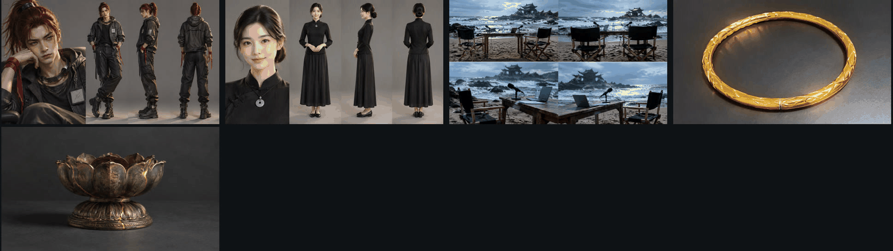
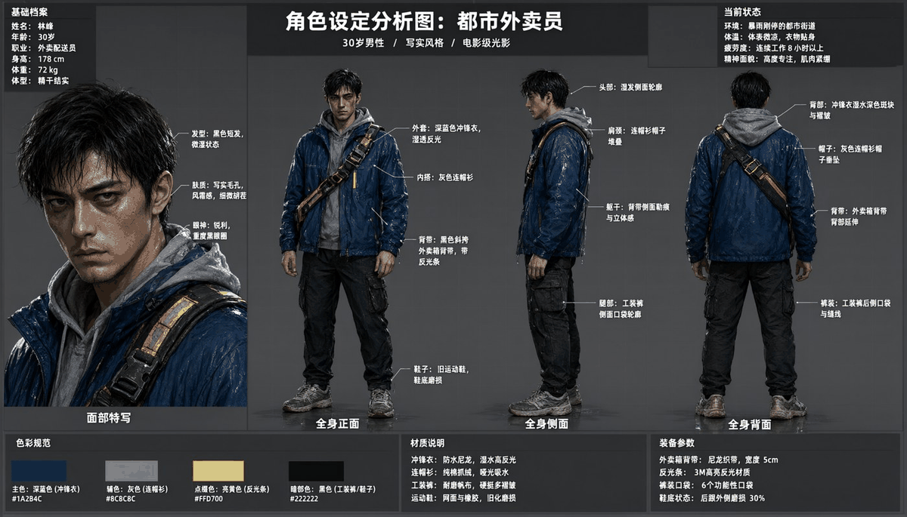
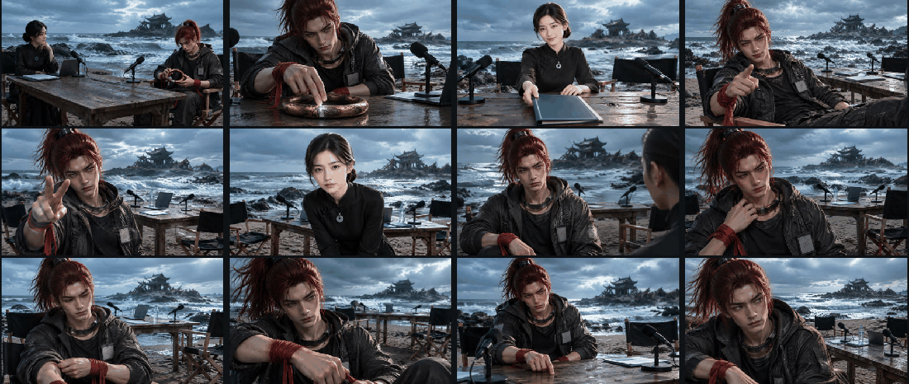
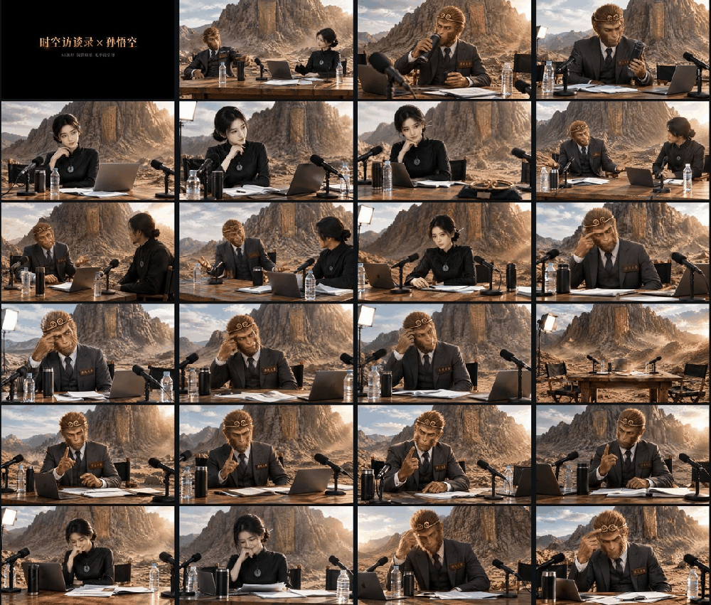
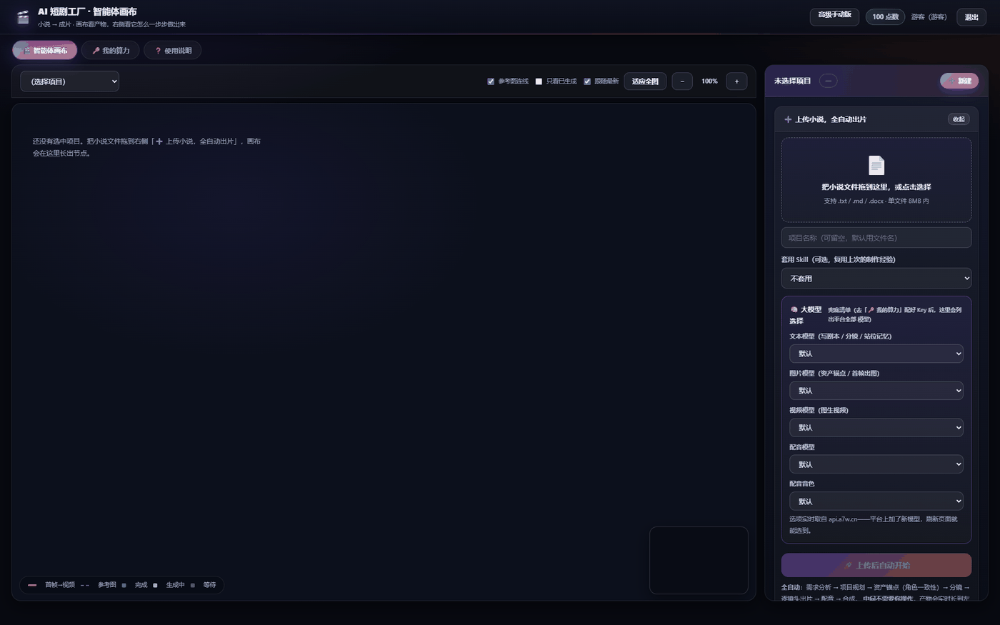

# 三剪客 · AI 短剧工厂出片全流程

> 把一本小说跑成一部成片的工业化流程。**所有算力走 [`api.a7w.cn`](https://api.a7w.cn/)**。

做 AI 短剧，劝退人的从来不是「能不能生成」，而是这四件事：

```
① 改了剧本，下游全部重出          → 没人用得起
② 第 1 集和第 20 集不是同一个人   → 观众一眼出戏
③ 画面里突然冒出一行乱码字幕      → 直接不能发
④ 跑到一半出问题，只能从头再来    → 钱白烧
```

这份 Skill 把这四件事的处理方式交给你——**图文并茂，20 张实测配图**。


---

## 这个包解决什么

| 你要什么 | 这个包给什么 |
|---|---|
| 从小说到成片的完整流程 | **十个阶段**的切分与产出定义，人工只在规划阶段确认一次 |
| 人物一致性到底怎么锁 | **双锁**：多参考图 + 全局硬约束（**附可直接复制的提示词原文**） |
| 跨镜头状态接不上 | **站位记忆**：逐镜写起始快照 / 变化 / 末态，末态与下镜起始逐字一致 |
| 分镜怎么写才不返工 | **九条铁律** + **四类过渡桥梁** |
| 模型老是 400 | **逐模型参数差异表**（qwen-image / gpt-image / h3 / wan / veo / grok 各吃一套） |
| 一集要花多少点 | **实测单价 + 成本台账**，视频占九成以上 |
| 跑到一半失败了 | **断点续跑**：逐镜台账 + 幂等 + 对账 |

---

## 快速开始

```bash
# 1. 校验并保存你的 api.a7w.cn Key（写到 ~/.a7w/config.json，权限 600）
python3 scripts/preflight.py login --key sk-你的key

# 2. 体检：余额 / 可用模型 / 音色 / 已知死模型
python3 scripts/preflight.py check

# 3. 估一集的预算（13 镜 × 5 秒，按景别混合档位）
python3 scripts/preflight.py budget --shots 13 --avg-seconds 5 --tier mixed

# 4. 出片前拦截参数错误（离线，不联网）
python3 scripts/preflight.py lint --shots my-shots.json
```

`preflight.py` **零依赖**（只用 Python 标准库）、**不内嵌任何密钥**、不申请子进程权限。

### 预算估算示例

```
镜头数        13
平均单镜时长  5.0s
档位策略      mixed
  · h3-video       768P   7 镜 × 5.0s × 50 点/秒
  · wan3.0-video   480P   6 镜 × 5.0s × 28 点/秒
------------------------------------------------------------
出图             260 点
视频            2590 点   ← 占 91%
配音               0 点   （零样本克隆实测 0 点）
合成               0 点   （字幕 / 剪辑 / 合成实测 0 点）
------------------------------------------------------------
合计 ≈ 2850 点  ≈ 28.50 元
```

### 参数体检示例

```
✗ 7 个会 400 的错误：
   镜头 #2：h3 的 resolution 只认 2K/768P，给了 '720P'
   镜头 #2：h3 的 duration **必须是字符串**，传数字 5 会被拒
   镜头 #4：wan 的 duration 必须取整（3.5s 会让任务「处理失败」）
   镜头 #4：wan 的**首尾帧模式不能与参考图混用**（官方硬约束）
   镜头 #5：qwen-image 参考图上限 3 张，给了 4 张
   镜头 #7：模型 seedance 在平台列表里但实测不可用，换掉
   镜头 #8：veo 只吃 1 张图，给了 2 张会被判参数不符
```

---

## 配图清单（20 张，全部真实产出）

完整清单见 [`references/配图清单.md`](references/配图清单.md)——每张都标了**文件、尺寸、画面里实际有什么、建议用途、放在哪一节**。

### 头图级


**`film/01-hero-nezha.png`（1150×646）** — 哪吒伸手按乾坤圈。深红高马尾 / 左眉旧疤 / 黑灰夹克 / 脖子金属圈 / 手腕红绫，5 处造型特征全部可见；背景陈塘关海边 + 半塌龙王庙。**画面里没有任何字幕。**

### 说服力级 · 一致性



**`film/02-anchors-nezha.png`（1600×450）** — 角色三视图 + 场景四角度 + 道具。**这张是「一个角色挂多张参考图」的可视化证明。**



**`proof/17-charsheet-real.png`（1200×685）** — 面部特写 + 全身正/侧/背三视图 + 色彩规范（带 HEX）+ 材质说明 + 装备参数。**「锚点描述要具体到可验证」的教科书例子。**

### 震撼级 · 产出规模



**`film/03-storyboard-wall-nezha.png`（1100×466）** — 12 个镜头首帧拼成的分镜墙。**哪吒 12 格同一张脸。**



**`film/05-storyboard-wall-wukong.png`（1000×851）** — 孙悟空 **43 镜**分镜墙，规模大三倍多。

### 信任状级 · 成本透明


**`ui/13-canvas-video-node.png`（1400×833）** — 模型 `wan3.0-video` / 任务号 `task_vh3` / **实扣 100 点** / 5 秒 / 来源首帧 / 完整生成提示词。**每一条生成都能查到它花了多少点。**

### 核心差异化 · 模型实时取自平台



**`proof/18-model-picker.png`（1400×875）** — 文本 / 图片 / 视频 / 配音模型与音色五组下拉，红点标着「选项实时取自 api.a7w.cn」。**模型不是我写死的，是从平台实时拉的。**

### 还有 15 张

`film/04`（成片抽帧）、`film/06`~`film/10`（孙悟空 / 雨夜项目）、`ui/11`（一句话生成）、`ui/12`（完整画布）、`ui/14`（规划确认卡片）、`ui/15`~`ui/16`（提示词编辑）、`proof/19`（650 音色）、`proof/20`（节点级模型覆盖）—— 全部在 [`references/配图清单.md`](references/配图清单.md) 里逐张说明。

### 在线可直接引用的 5 张

```
https://hq.a7w.cn/showcase/nezha_hero.png
https://hq.a7w.cn/showcase/nezha_anchors.png
https://hq.a7w.cn/showcase/nezha_storyboard_wall.png
https://hq.a7w.cn/showcase/nezha_film_frames.png
https://hq.a7w.cn/showcase/wukong_storyboard_wall.png
```

> **⚠️ 一致性有一个真实边界**：分镜墙里**哪吒是稳的，但主持人的脸在不同镜头间会漂**。原因、修法与「引用时只用哪吒那部分」的建议，写在 `配图清单.md` 第四节。**这一条我们如实写出来了。**

---

## 包结构

```
short-drama-factory/
├── SKILL.md                                  主文档（图文并茂）
├── README.md                                 本文件
├── LICENSE.md                                MIT
├── assets/                                   20 张实测配图
│   ├── film/    10 张（头图 / 锚点物料 / 分镜墙 / 成片抽帧）
│   ├── ui/       6 张（一句话生成 / 画布 / 节点详情 / 规划卡片 / 提示词）
│   └── proof/    4 张（角色设定图 / 模型选择 / 650 音色 / 节点覆盖）
├── references/
│   ├── 十阶段流水线与断点续跑.md
│   ├── 一致性双锁与禁文字原文.md              ← 可直接复制的提示词原文
│   ├── 分镜九铁律与过渡桥梁.md
│   ├── 模型参数适配表.md                      ← 逐模型参数差异 + 死模型清单
│   ├── 真实单价与成本台账.md
│   ├── 排错与已知限制.md
│   └── 配图清单.md                            ← 20 张图逐张说明
└── scripts/
    └── preflight.py                          零依赖体检脚本（不内嵌密钥）
```

---

## 权限与用途说明

| 能力 | 是否申请 | 用途 |
|---|---|---|
| 网络访问 | **申请** | 调用 `api.a7w.cn` 的网关与应用接口（本包唯一的联网行为） |
| 读取文件 | 仅读取你指定的素材与 `--shots` 参数文件 | 作为流水线输入与参数校验 |
| 写入文件 | 仅 `login` 子命令写 `~/.a7w/config.json` | 保存你自己的 Key；权限 600 |
| 凭证 | 读取**使用者自己**提供的 API Key | 环境变量 `A7W_API_KEY` 或 `~/.a7w/config.json` |
| 子进程 / 后台常驻 | 不申请 | 脚本执行完即退出 |

**不内嵌任何密钥。** 脚本只把 Key 发往 `api.a7w.cn`。

## 能力边界

**覆盖**：从小说到成片的完整方法论、人物一致性双锁、站位记忆、分镜铁律、逐模型参数适配、成本台账、断点续跑。

**不覆盖**：

- **不提供 API Key、不代付费用**——Key 与点数必须是你自己的 `api.a7w.cn` 账号
- **不做口型同步**——平台没有口型同步模型，本方案是**后叠配音**，口型不逐字对应
- **不保证画质与可用性**——以 `api.a7w.cn` 站内为准
- **不替代内容合规审查**

## 依赖条件

- **Python 3.8+**，只用标准库，无需 `pip install`
- 一个 [`api.a7w.cn`](https://api.a7w.cn/) 账号，已实名并创建 API Key
- 能访问 `https://api.a7w.cn`
- **可选**：本地 `ffmpeg`（只有合成阶段需要）

## 已知限制（摘要）

1. **口型不逐字对应**——平台无口型同步模型，本方案后叠配音；行业通行做法是用快切掩盖（平均 5.8 秒一刀）
2. **长镜头会漂移**——同角色超过 **8 秒**开始变脸，建议 **4~8 秒短镜拼接**
3. **配角一致性弱于主角**——锚点描述越具体越稳，配角也要强制填 3 个以上特征
4. **图像模型参考图上限偏低**——Qwen Image 只有 3 张，锁角色需要 6~12 张，可改用 `gpt-image-*`（12 张）
5. **预设音色库需单独接入**——`list_voices` 只返回用户自克隆的音色
6. **`/chat/completions` 不回传 `points_cost`**——文本阶段实扣点数只能靠余额差分推算
7. **上游 60 秒网关超时**——长输出阶段必须分批
8. **文档与实测常有出入**——模型数、价格、可选档位都会变，要准数就现场拉

完整版见 [`references/排错与已知限制.md`](references/排错与已知限制.md)。

---

## 适配不同宿主

| 宿主类型 | 怎么用 |
|---|---|
| **支持 Skill 规范**（DSH / Claude Code / TRAE 等） | 把整个目录放进宿主的 skills 目录，AI 自己读 `SKILL.md`，按需执行 `scripts/preflight.py` |
| **纯聊天，不能执行代码/出网** | 只能把 `SKILL.md` 与 `references/` 当知识库问答 |

> **相对路径提示**：文档里写的是 `python3 scripts/preflight.py`，取决于运行时的工作目录。若宿主在项目根目录执行，请先 `cd` 到本技能目录，或改用绝对路径。

## 联系我们

- **技术微信：9872659** —— 加好友时说一下是从哪个 Skill 找过来的，直接给你配套的 API Key 与能跑的示例。
- **要算力 / 要 API Key**：[算力集市 · 注册领 API Key](https://api.a7w.cn/) —— 一个 Key 调用全部 AI 算力，注册、充值、创建 Key 都在这里。
- **更多 AI 插件与接口**：[AI 插件市场](https://aigc.a7w.cn/)。


---

## 相关链接

| 链接 | 地址 | 说明 |
|---|---|---|
| [算力集市 · 注册领 API Key](https://api.a7w.cn/) | api.a7w.cn | 一个 Key 调用全部 AI 算力；注册、充值、创建 Key 都在这 |
| [AI 插件市场](https://aigc.a7w.cn/) | aigc.a7w.cn | 浏览全部 AI 插件与接口说明 |
| [三剪客 · 一句话批量出片](https://ks.a7w.cn/) | ks.a7w.cn | 短剧二创 / 影视解说 / 矩阵号批量混剪桌面客户端 |
| [视频超清 · 在线批量超分](https://vr.a7w.cn/) | vr.a7w.cn | 网页版视频超分，批量处理，最高 4K |
| [0人公司 · AI Agent 平台](https://a7w.cn/) | a7w.cn | 主站，了解整套 AI Agent 生态 |
