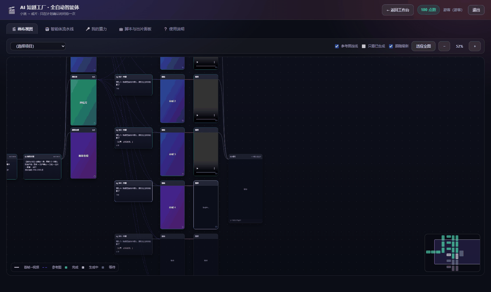
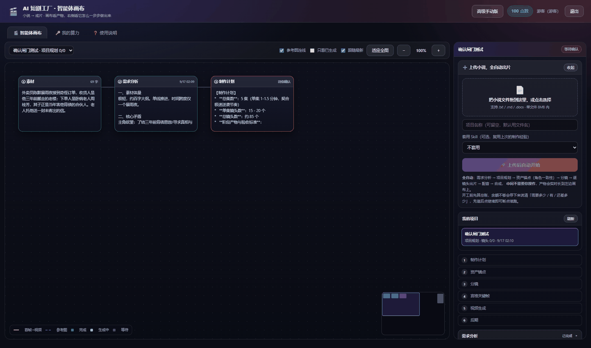
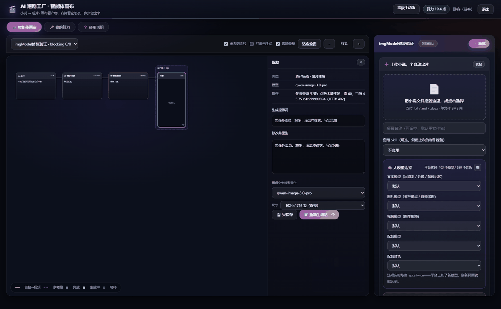
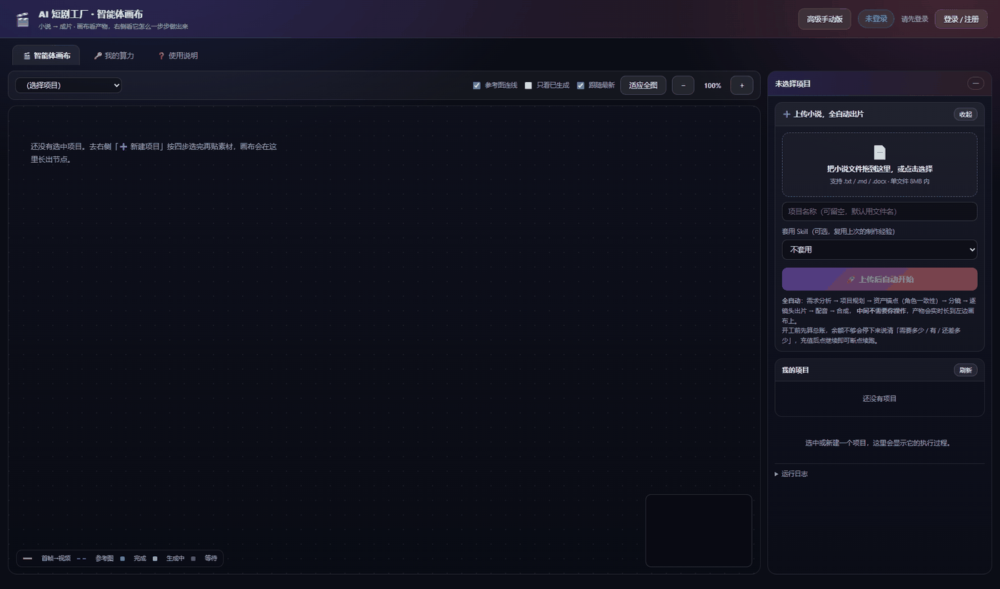
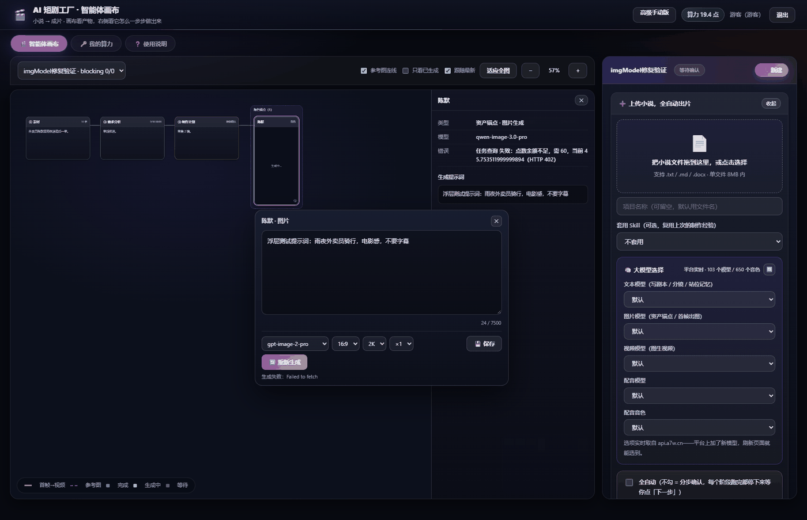
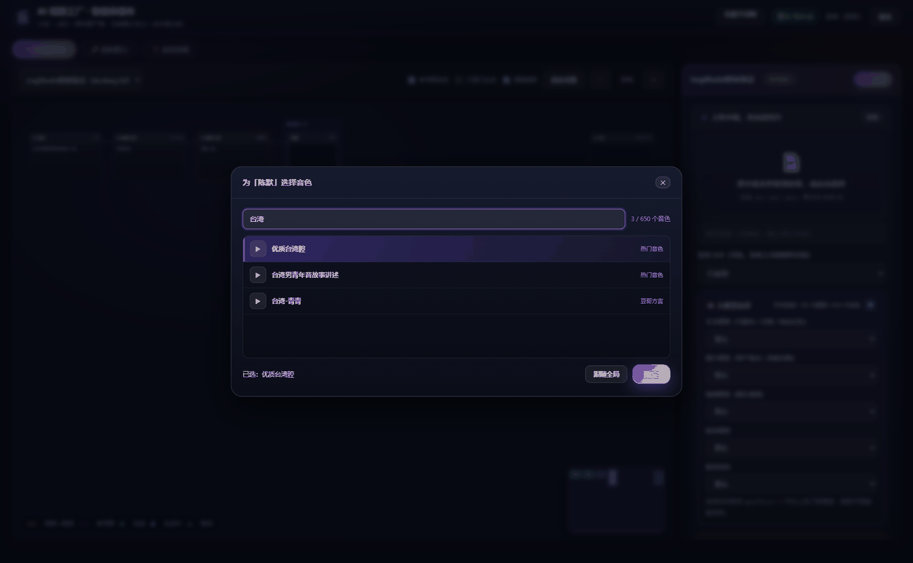
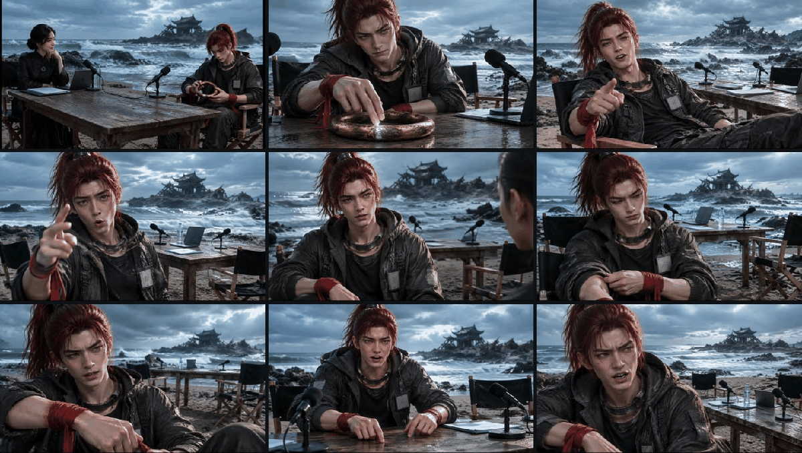
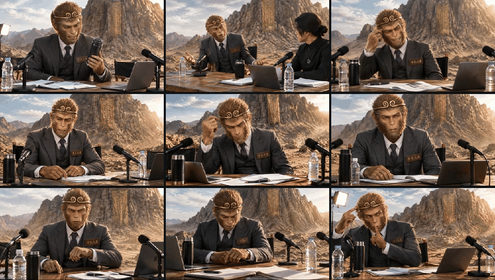
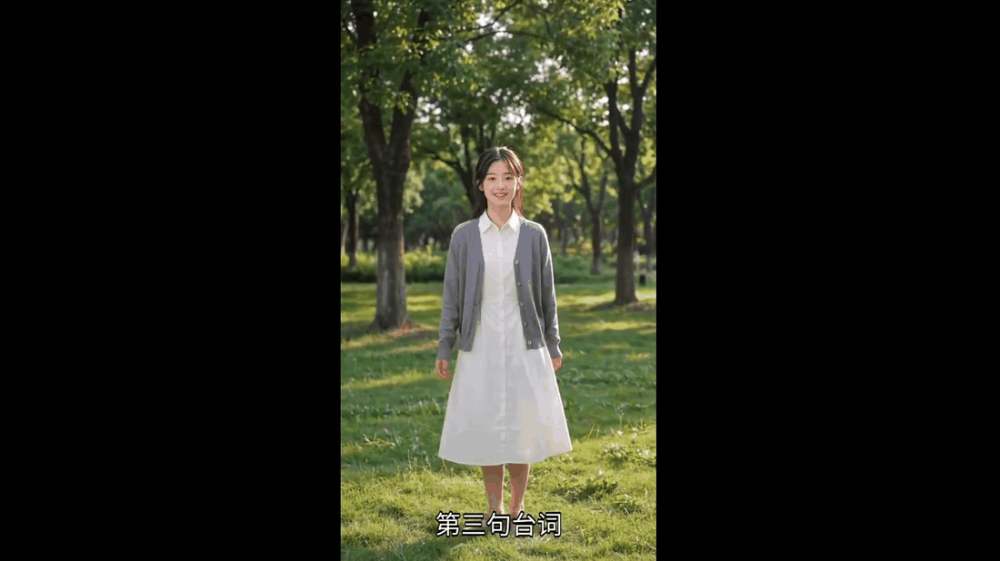
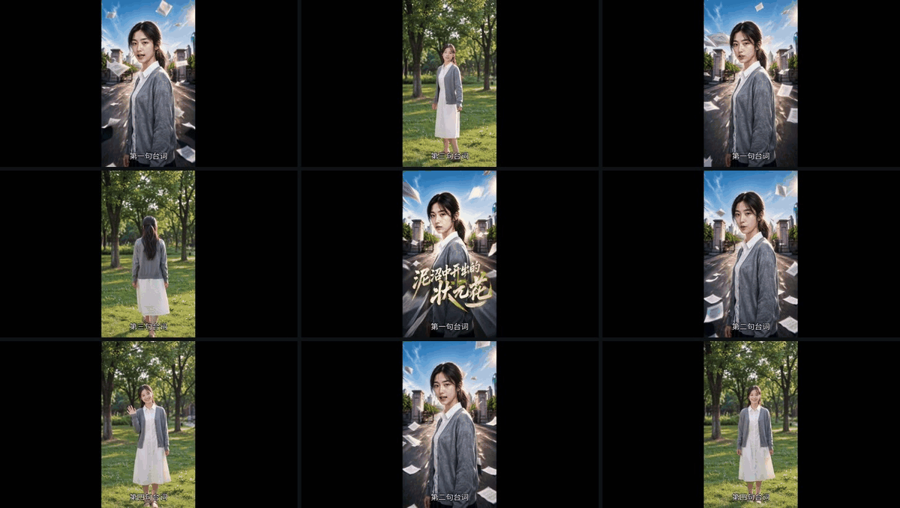

# 三剪客 · AI 短剧工厂出片全流程


做 AI 短剧，劝退人的从来不是「能不能生成」，而是这四件事：

```
① 改了剧本，下游全部重出          → 没人用得起
② 第 1 集和第 20 集不是同一个人   → 观众一眼出戏
③ 画面里突然冒出一行乱码字幕      → 直接不能发
④ 跑到一半出问题，只能从头再来    → 钱白烧
```

这份 Skill 就是把我们踩过这四件事之后**沉淀下来的做法**交给你：十个阶段的流水线怎么切、人物一致性到底靠什么锁住、每个模型吃哪一套参数（这是最容易 400 的地方）、以及每一分算力花在哪。

**所有算力统一走 [`api.a7w.cn`](https://api.a7w.cn/)**——文本、图像、视频、语音四类能力一个 Key、一份账单。没有本地 GPU 也不用自建推理服务：注册领 Key 就能按下面的参数直接调。

> 下面所有配图都是**真实产出**，不是示意图。UI 截图取自 `https://hq.a7w.cn/agent.html`（本方法的参考实现），成片图取自实跑项目。

---

## 一、为什么难：三个真正的分水岭

### 坑一：改了剧本，下游全部重出

一部 3 分钟的片子大约 **3000~9000 点**。改一句台词就全部重出，没人用得起。

**做法**：分镜表给每个镜头记「来自哪段剧本」，剧本变了只标脏变化的那几条。**改一句台词，只重出受影响的镜头。**

### 坑二：第 1 集和第 20 集不是同一个人

这是 AI 短剧最致命的问题。实测结论：

- **只把参考图传进去、不写要求** → 模型把它当「松散参考」，脸会变
- **同一角色连出 5 个镜头** → 到第 3 个就开始换脸

**只靠参考图不够。** 必须两道锁一起上：

```
锁一：多参考图 —— 一个角色可挂多张图，每张标用途
      正面照锁脸 / 侧面照锁轮廓 / 服装图锁服装 / 场景图锁空间

锁二：全局硬约束 —— 只要传了参考图，请求里自动追加一段强制要求
      "面孔、五官比例、脸型、年龄、发型、发色、肤色、服装款式与配色
       必须与参考图完全一致，是同一个人的同一套造型；
       不要换脸、不要改年龄、不要改发型、不要改服装、不要美化或年轻化。"
```

图给的是**视觉锚点**，硬约束给的是**不许偏离**。缺一个都会漂。


这张就是「锁一」的物料本身：**面部特写 + 全身正/侧/背三视图**，加上色彩规范、材质说明、装备参数。做扎实了，后面出片才不会换脸。

### 坑三：画面里突然冒出一行字

视频模型特别爱自己在画面上加**字幕、标题、logo**，而且经常是**乱码**。

**做法**：在参数适配层做**全局强制排除**——所有出图出片的提示词都自动追加禁文字要求，连桌面文件、名牌、墙面、屏幕、衣物上的可读文字都排除掉。

注意：**光写一句「不要字幕」压不住**。实测长镜头里模型会把环境纹理「读」成文字自己长出来。要用**多角度、强否定、带正面替代描述**的写法（原文见 `references/一致性双锁与禁文字原文.md`）。

需要字幕怎么办？成片阶段单独烧录，用本地渲染器（**不扣平台点数**）。

---

## 二、十个阶段流水线



```
① 需求分析  →  ② 制作前问询  →  ③ 项目规划  →  ④ 资产锚点  →  ⑤ 站位记忆
→  ⑥ 分镜设计  →  ⑦ 逐镜头出片  →  ⑧ 配音  →  ⑨ 合成成片  →  ⑩ 完成
```

| # | 阶段 | 做什么 | 产出 | 要人参与吗 |
|---|---|---|---|---|
| 1 | **需求分析** | 读素材，抽体量 / 核心矛盾 / 爽点 / 人物 / 场景道具 / **物料质检** | 分析报告 | 否 |
| 2 | **制作前问询** | 8 项制作参数（模式 / 画幅 / 帧率 / 语言 / 字幕 / 音频 / BGM / 时长） | 带来源的参数表 | 可选（默认自动） |
| 3 | **项目规划** | 制作计划 + 3 个剧情 brief | 基础信息表 + 制作清单 | 可选确认 |
| 4 | **资产锚点** | 生成角色 / 场景 / 道具参考图，**固定 seed + 稳定 ID** | 每个锚点一张图 | 否 |
| 5 | **站位记忆** | 算清「谁在哪、朝哪、道具在谁手上」，逐镜写**起始快照 / 变化 / 末态** | 主锚 + 站位 + 轴线 + 视线 + **跨镜头状态承接** | 否 |
| 6 | **分镜设计** | 按九条铁律拆镜头，写光影时辰 / 音效 / 过渡桥梁 | 分镜表 | 否 |
| 7 | **逐镜头出片** | 每个镜头：出首帧图 → 图生视频 | 每镜一段视频 | 否 |
| 8 | **配音** | 按角色配声线 | 每镜音频 | 否 |
| 9 | **合成成片** | 拼接 + 烧字幕 | 成片 | 否 |
| 10 | 完成 | — | — | — |

**人工只在「项目规划」确认一次，其余全自动。** 关掉页面它也在服务端继续跑。



### 关键机制：站位记忆的跨镜头状态承接

这是**跨镜头一致性的核心**。每个镜头一行：

```
sg_001  起始：陈默在楼梯口端站立，面朝周桂芳；信闭合在陈默右手
        变化：陈默停步、收拢右手、换左手抬信
        末态：陈默举信至胸前；周桂芳视线在信上；信在陈默手中（开启）

sg_002  起始：陈默举信至胸前；周桂芳视线在信上；信在陈默手中（开启）  ← 与上镜末态逐字一致
```

出图时会把 **本镜起始快照 + 上一镜末态 + 光影** 一起拼进提示词。

> **参考图 + 固定 seed 保证「长得像」，快照保证「状态接得上」——两者叠加才稳。**
> 只有前者的话，人物是同一张脸，但手里的信可能一会儿在右手一会儿在左手。

服务端会自检：第 N 镜末态与第 N+1 镜起始不一致时记警告并列出镜头对（**只警告不阻断**）。

### 关键机制：分镜九铁律

写死在提示词里的九条：

| # | 铁律 |
|---|---|
| 1 | **台词零删改**——逐字搬运，禁合并 / 精简 / 省略修饰词 |
| 2 | 台词时长按 **4 字/秒**估算，按情绪分配，不平均切 |
| 3 | 每个镜头 **≤15 秒** |
| 4 | 长台词**超 20 字强制拆镜**，按语义停顿点切 |
| 5 | **在场人物不能凭空消失**（没写「离开」就还在场，必须有视觉痕迹） |
| 6 | **人物外观交给图片资产**——长相 / 服装 / 发型不进分镜提示词 |
| 7 | 声音只写**环境音 + 音效**，**禁 BGM** |
| 8 | 画面只写动作、姿态、表情、正在发生的状态变化 |
| 9 | **光影时辰要写**（会被带进出图提示词） |

外加**四类过渡桥梁**，要求每个镜头写明用了哪一类：动作桥梁 / 情绪接力 / 空间与视线 / 台词与动作黏合。详见 `references/分镜九铁律与过渡桥梁.md`。

---

## 三、模型参数：这是最容易 400 的地方

**同一个平台的模型，参数格式并不统一。**我们把探测到的差异整理成表——这是本 Skill 最省你时间的一块：

| 模型族 | 入参风格 | 参考图字段 | 上限 | 关键约束 |
|---|---|---|---|---|
| `qwen-image-*` | `input.messages` 单条用户消息 | message 里的 `image` 内容块 | **3 张** | **必须显式给 `parameters.n = 1`**，不给被判「n 必须为 1」 |
| `gpt-image-*` / `nano-banana-*` | **顶层 `prompt`** | 顶层 `image_urls` 数组 | 12 张 | 与 qwen 完全不同格式；**丢了参考图就会凭空编人物** |
| `h3-video` / `minimax` | 顶层 `content` 数组 | `content[].image_url.url` | 多条 | `resolution` **只认 `768P` / `2K`**；`duration` **只认 4/5/6/7/8/10/12/15 且必须是字符串**；`ratio` 只认 16:9 / 9:16 / 1:1 / 4:3 |
| `wan3.0-video` | `input.media` + `parameters` | `media[].{first_frame,reference_image,last_frame}` | 10 图 / 5 视频 / 5 音频 | `768P` **不认**，只认 480P / 720P；`duration` **必须取整且 ≥3 秒**；`seed` 放在 `parameters` 内 |
| `veo3.1-*` | 顶层 `prompt` / `quality` | 顶层 `image` | **1 张** | 多给会被判参数不符 |
| `grok-video` | 顶层 `prompt` / `duration` | 顶层 `image` | **1 张** | 同上 |

⚠️ **已经出现在平台列表里、但实测不可用的模型**（别再让用户选）：
`seedance`、`full-video`、`happy-horse`、`wan`、`flashvsr`、`Wan-AI/Wan2.2-T2V-A14B`、`Wan-AI/Wan2.2-I2V-A14B`。
其中 `full-video`（全能视频生成）报「未上架」，真正可用的通用多模态是 **`h3-video`（MiniMax H3）**。

### 一个必须知道的硬约束：首尾帧不能与参考图混用

Wan 3.0 官方明确：**首帧/尾帧模式不能与参考图片、参考视频、参考音频、文件或网页链接混用。**

这直接改掉了出片逻辑——一致性必须拆成**两把锁，不能在同一支视频里同时上**：

```
锁一：出首帧图时把资产锚点当参考图（qwen-image 上限 3 张）+ 固定 seed
锁二：视频阶段只吃首帧（图生视频），由首帧把人物/场景锁住
```

### 按景别自动挑模型（省钱的关键）

不是所有镜头都值得用贵的模型：

```
全景 / 中景 / 远景  →  h3-video 768P（画面信息多，值得）
近景 / 特写 / 道具  →  wan3.0-video 480P（省一半以上）
```

判断顺序有坑：`中近景` 里含「近景」，**必须先判中景类再判近景**，否则会误判成 480P。


文本模型、图片模型、视频模型、配音模型、配音音色都是可选的，**选项实时从 `api.a7w.cn` 拉取**——平台上加了新模型，刷新页面就能选到。

单个节点还可以**单独覆盖模型**（下面右图：把某个锚点指定用 `qwen-image-3.0-pro`、尺寸 1024\*1792 竖屏）：



---

## 四、成本：实测算出来的单价

**本站不赚你算力的差价**——所有生成都调你自己的 Key，费用记在你自己账上。所以成本必须算得清。

单价全部来自**实测扣费记录**，不是估算：

| 项目 | 实测单价 |
|---|---|
| 出图（`gpt-image-2-pro`） | **20 点/张** |
| 视频 `h3-video` 768P | **50 点/秒**（5.167s = 250 点） |
| 视频 `wan3.0-video` 720P | **55 点/秒**（6s = 330 点） |
| 视频 `wan3.0-video` 480P | **28 点/秒**（7s = 196 点） |
| **配音（零样本克隆）** | **0 点** |
| **字幕 / 水印 / 剪辑 / 合成** | **0 点** |

> **注意后两行**：配音和后期在这里是 0 点，在别家通常要单独收费。

**视频占九成以上成本。** 省钱唯一有效的方向是**减少要生成的视频秒数**（少几镜、短一点、低分辨率），而不是省图片钱。

### 实测项目台账

| 项目 | 规模 | 结果 |
|---|---|---|
| 哪吒（1 分钟反转版） | 13 镜 | 成片 105.7 秒，带完整配音 |
| 孙悟空 | 43 镜 | 成片 388 秒 |
| 雨夜最后一单 | 4 镜 | 成片 40 秒 |

哪吒那部 13 镜的预估成本 **1950 点**，拆开是：

```
锚点    0 点（复用已有）
首帧   20 点（1 张待出）
视频 1930 点（65 秒，均价 30 点/秒）
配音    0 点
合成    0 点
```

### 余额不够时的正确处理

**开工前先算总账**，不够就停下来说清：

```
需要 8800 点 / 你的账号有 189.6 点 / 还差 8610.4 点（每镜约 440 点，待生成 20 镜）
```

**关键：这时候一个镜头都没生成，一分钱没花。** 充值后点「继续出片」即可**断点续跑**，已完成的镜头不会重复生成（逐镜台账 + 幂等续跑）。

> BYO Key 模式下能做「生成前预估、生成后记账、成本报表」，**不能做站内冻结/结算**——钱不在工具手里。要准数字以 `api.a7w.cn` 实际扣费为准。

预算估算法与两套价格字段（公示标准价 vs 租户实收价）见 `references/真实单价与成本台账.md`。

---

## 五、界面实证

### 一句话 → 一本小说



一句话输入：**「一个外卖员在暴雨夜接到一单送往殡仪馆的订单，收货人写的是他自己的名字。」**

**它不是一次生成的。** 一次让模型写两万字，后半段一定崩，拆成三步：

```
① 立意   一句话 → 书名 / 题材 / 主角 / 对手 / 核心冲突 / 情绪基调 / 开篇钩子
② 大纲   立意 → N 章，每章标题 + 剧情梗概，要求"章与章有递进、最后两章有反转"
③ 扩写   逐章写正文，每章带上"上一章结尾 400 字"保证接得上
```

**踩过的坑**：中间某章失败，最初的处理是**整本中断**，重跑又从头烧钱。现在改成**单章失败跳过、已写的保留、随时续跑**。

### 节点详情：实扣点数摆在节点上


点开任何一个节点，能看到 **模型、任务号、实扣点数、生成时间、来源首帧、完整生成提示词**。上例：`wan3.0-video`，`task_vh3`，**实扣 100 点**，5 秒。

### 提示词可手改、可重生成



选中节点可以改提示词重新生成一个版本，**旧版本不会被覆盖**——工具栏上出现 `◀ 2/3 ▶` 切换器，合成时用你选中的那个。

### 配音：650 个预设音色



**每个角色可以选不同声线**，按性别 / 年龄 / 方言 / 风格筛。实测平台侧 `voice_tts/list_voices` 只返回用户自己克隆的音色，预设音色库需另外接入（见「已知限制」）。

---

## 六、做出来的片子长什么样

**人物一致性**——同一个哪吒，12 个镜头同一张脸、同一套造型：


**多参考图锁长相**——角色三视图 + 主持人三视图 + 场景四角度 + 乾坤圈 + 莲花台，全部作为可挂载的锚点：


**成片抽帧**——注意这是从**成片**里抽的帧，不是拼图：



规模更大的那一部（43 镜）：




另一个题材（都市悬疑）：





### ⚠️ 但一致性有一个真实的边界

**我们在做分镜墙的时候发现：主角是稳的，配角会漂。**

看上面那张哪吒分镜墙——**哪吒 12 格全部是同一张脸**，但**主持人的脸在不同镜头间有变化**。

**原因**：哪吒的锚点做了 **5 处具体造型约束**（深红高马尾 / 左眉旧疤 / 黑灰夹克 / 脖子金属圈 / 手腕红绫），**特征越具体越容易被模型抓住**；主持人的描述相对笼统（"黑色中式立领 / 低发髻 / 翡翠平安扣"），**约束力弱一些**。

**这正好印证了产品逻辑**：

```
锚点描述越具体   → 一致性越好
多挂几张参考图   → 一致性越好
```

**建议**：配角也应该强制要求填 3 个以上具体特征，不能只给「黑衣服、盘发」这种量级的描述。

---

## 七、触发场景

- 「我要把一本小说做成短剧，从哪开始、大概要花多少点？」
- 「AI 出的视频第 1 集和第 20 集不是同一个人，怎么锁住？」
- 「同一个角色连出几个镜头就换脸，参考图传了也没用。」
- 「画面里老是自己长出乱码字幕，怎么彻底禁掉？」
- 「`qwen-image` / `gpt-image` / `h3-video` / `wan3.0-video` 的参数到底各要什么格式？」
- 「跑一集短剧要多少点？视频、出图、配音、合成分別占多少？」
- 「跑到一半失败了，能不能不重头再来？」
- 「长镜头里人物会漂移，多长算安全？」

## 八、工作流路由

| 你要什么 | 看哪份 |
|---|---|
| 十个阶段各自做什么、怎么串、断点续跑 | `references/十阶段流水线与断点续跑.md` |
| 一致性双锁的**原文提示词**、禁文字硬约束原文 | `references/一致性双锁与禁文字原文.md` |
| 分镜九铁律、四类过渡桥梁、站位记忆写法 | `references/分镜九铁律与过渡桥梁.md` |
| 逐模型参数差异、死模型清单、分辨率与时长映射 | `references/模型参数适配表.md` |
| 真实单价、成本占位、预算估算 | `references/真实单价与成本台账.md` |
| 全流程卡住了怎么查 | `references/排错与已知限制.md` |
| **配图清单**：每张图的文件、尺寸、内容、建议用途 | `references/配图清单.md` |
| 上手前先跑一遍体检 | `scripts/preflight.py` |

## 九、权限与用途说明

| 能力 | 是否申请 | 用途 |
|---|---|---|
| 网络访问 | **申请** | 调用 `api.a7w.cn` 的网关与应用接口（本 Skill 唯一的联网行为） |
| 读取文件 | 仅读取你指定的素材（小说 / 剧本 / 参考图 / 音频） | 作为流水线的输入与参考图 |
| 写入文件 | 仅在传入 `--out` 时 | 落盘分镜表 / 成本台账 / 体检报告 |
| 凭证 | 读取**使用者自己**提供的 API Key | 从环境变量 `A7W_API_KEY` 或 `~/.a7w/config.json` 读取 |
| 子进程 / 后台常驻 | 不申请 | 脚本执行完即退出，不注册服务、不常驻 |
| 调用 ffmpeg | **可选**，仅本地合成阶段 | 拼接镜头与烧字幕；不做则跳过合成 |

**不内嵌任何密钥。** 脚本只把 Key 发往 `api.a7w.cn`，不发送到其他任何地址。

## 十、能力边界

**覆盖**：

- 从小说到成片的**全流程方法论**：十阶段切分、站位记忆、分镜铁律、过渡桥梁
- **人物一致性**的具体做法：多参考图挂载策略 + 全局硬约束原文 + 固定 seed
- **逐模型参数适配**：qwen-image / gpt-image / nano-banana / h3 / wan / veo / grok 各自要什么
- **成本台账**：真实实测单价、按景别选模型、余额不足的断点续跑
- 一个零依赖 `scripts/preflight.py`：体检 Key、余额、可用模型、参数合法性

**不覆盖**：

- **不提供 API Key、不代付费用**：Key 与点数必须是你自己的账号
- **不做口型同步**：平台没有口型同步模型，本项目是**后叠配音**，音色统一但口型不逐字对应
- **不保证可用性与最终画质**：模型上下架、限流、计费以 [`api.a7w.cn`](https://api.a7w.cn/) 站内为准
- **不替代内容合规审查**：生成内容的合规责任由使用者承担
- **不直接操作 `hq.a7w.cn` 的界面**：那只是一个参考实现，本 Skill 给的是可迁移的方法与参数

## 十一、依赖条件

- **Python 3.8+**，只用标准库（`urllib`），无需 `pip install`
- 一个 [`api.a7w.cn`](https://api.a7w.cn/) 账号，已完成实名并创建 API Key
- 能访问 `https://api.a7w.cn` 的网络出口
- **可选**：本地 `ffmpeg`（只有合成阶段需要）

## 十二、已知限制

1. **口型不逐字对应。** 平台没有口型同步模型，本项目是后叠配音。行业里的通行做法是用**快切**掩盖（参考片平均 5.8 秒一刀）。
2. **长镜头会漂移。** 同一角色超过 **8 秒**的镜头，脸会开始变。**建议 4~8 秒短镜拼接**，不要做 15 秒以上的长镜——这也正好符合短视频节奏。
3. **分辨率还可以更高。** 近景用 480P、全景用 768P。平台上有支持 1080P/4K 的模型，但视频侧实测可用档位受模型限制（见参数表）。
4. **`/chat/completions` 不回传 `points_cost`。** `/tasks` 会返回 `usage.points_cost`，但文本接口没有——**文本阶段的实扣点数目前只能靠「调用前后余额差分」推算**。
5. **图像模型参考图上限偏低。** 全站图像模型只有 2 个（Qwen Image 3.0 / 3.0 Pro），**参考图上限 3 张**。锁一个角色要「正面 / 侧面 / 背面 + 服装 + 道具 + 场景」至少 6~12 张，3 张不够。可改用 `gpt-image-*`（上限 12 张）。
6. **预设音色库需单独接入。** `voice_tts/list_voices` 只返回当前用户自己克隆的音色；650 个预设音色在 API 侧没有直接入口。
7. **推理模型会把输出预算烧在思考上。** 实测某模型 `reasoning_tokens: 1405 / 2311`，极端情况 `content` 为空串。**空内容要自动重试**并给足 `max_tokens`。
8. **文档与实测常有出入。** 平台上的模型数、价格、可选档位都会变。**要准数就现场拉，不要照抄本文档里的快照数字。**

## 十三、自检清单

跑完一集，按这几条过一遍：

- [ ] Key 走的是环境变量或 `~/.a7w/config.json`，**没有硬编进代码或提交进仓库**
- [ ] 出片前**先算过总账**，余额不足时确认「一个镜头都没生成」
- [ ] 每个主要角色的锚点**至少 3 个具体造型特征**（不要「黑衣服、盘发」这种量级）
- [ ] 每个角色挂了**多张参考图**，且每张标了用途（脸 / 轮廓 / 服装 / 场景）
- [ ] 请求里**确实追加了**一致性硬约束与禁文字约束（幂等，别重复追加）
- [ ] 视频请求**没有把首尾帧与参考图混用**（Wan 3.0 会直接拒）
- [ ] 分辨率与时长**按模型映射过**（h3 只认 768P/2K，wan 只认 480P/720P；h3 时长须为字符串且在合法集合内）
- [ ] 每个镜头 **≤15 秒**，同角色单镜 **≤8 秒**
- [ ] 上游 5xx / 超时走**退避重试**，而不是把整个项目判死
- [ ] 网络超时时**先查 `task_id` 再决定要不要重提**，避免重复扣费

## 参考文件

| 文件 | 用途 |
|---|---|
| `references/十阶段流水线与断点续跑.md` | 十个阶段详解、逐镜台账、幂等续跑、拆集拆场 |
| `references/一致性双锁与禁文字原文.md` | 一致性硬约束与禁文字约束的**可直接复制的原文** |
| `references/分镜九铁律与过渡桥梁.md` | 九条铁律、四类桥梁、站位记忆与快照格式 |
| `references/模型参数适配表.md` | 逐模型入参格式、上限、死模型、分辨率/时长映射 |
| `references/真实单价与成本台账.md` | 实测单价、成本结构、预算估算、余额不足处理 |
| `references/排错与已知限制.md` | 症状 → 原因 → 处置 对照表 |
| `references/配图清单.md` | **20 张配图**的文件、尺寸、内容、建议用途、投放位置 |
| `scripts/preflight.py` | 零依赖体检脚本（不内嵌任何密钥） |

## 联系我们

- **技术微信：9872659** —— 加好友时说一下是从哪个 Skill 找过来的，直接给你配套的 API Key 与能跑的示例。
- **要算力 / 要 API Key**：[算力集市 · 注册领 API Key](https://api.a7w.cn/) —— 一个 Key 调用全部 AI 算力，注册、充值、创建 Key 都在这里。
- **更多 AI 插件与接口**：[AI 插件市场](https://aigc.a7w.cn/)。


---

## 相关链接

| 链接 | 地址 | 说明 |
|---|---|---|
| [算力集市 · 注册领 API Key](https://api.a7w.cn/) | api.a7w.cn | 一个 Key 调用全部 AI 算力；注册、充值、创建 Key 都在这 |
| [AI 插件市场](https://aigc.a7w.cn/) | aigc.a7w.cn | 浏览全部 AI 插件与接口说明 |
| [三剪客 · 一句话批量出片](https://ks.a7w.cn/) | ks.a7w.cn | 短剧二创 / 影视解说 / 矩阵号批量混剪桌面客户端 |
| [视频超清 · 在线批量超分](https://vr.a7w.cn/) | vr.a7w.cn | 网页版视频超分，批量处理，最高 4K |
| [0人公司 · AI Agent 平台](https://a7w.cn/) | a7w.cn | 主站，了解整套 AI Agent 生态 |
