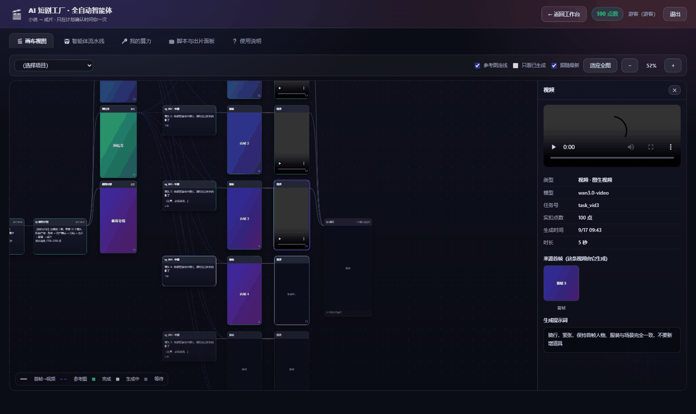

# 真实单价与成本台账

> **本站不赚你算力的差价。** 所有生成都调使用者**自己**的 `api.a7w.cn` Key，费用记在各自账上。所以成本必须算得清、摊得开。

---

## 一、实测单价

**全部来自实测扣费记录，不是估算：**

| 项目 | 实测单价 | 说明 |
|---|---|---|
| 出图 `gpt-image-2-pro` | **20 点/张** | |
| 视频 `h3-video` 768P | **50 点/秒** | 5.167s = 250 点 |
| 视频 `wan3.0-video` 720P | **55 点/秒** | 6s = 330 点 |
| 视频 `wan3.0-video` 480P | **28 点/秒** | 7s = 196 点 |
| **配音（零样本克隆）** | **0 点** | |
| **字幕 / 水印 / 剪辑 / 合成** | **0 点** | |

> ⚠️ 这是**某次实测的快照**。平台会调价，且**每个租户/Key 的实际结算价可能与公示标准价不同**——做预算时以实际扣费为准。
> `api.a7w.cn` 的计价单位是**点数**（**1 元 = 100 点**），并有**先冻结后结算、失败退款**的机制。

**注意最后两行**：配音和后期在别的方案里通常要单独收费，这里是 0 点。

---

## 二、成本结构：视频占九成以上

一集 12 镜的典型分布：

| 项 | 量级 | 占比 |
|---|---|---|
| 文本（分析 / 规划 / 站位记忆 / 分镜） | 约 20~60 点 | 极低 |
| 出图（每镜首帧 + 资产锚点） | 约 600~700 点 | 中 |
| **出视频** | **约 1200 点**（按 12 镜 × 5 秒 720P） | **>90%** |
| 配音 | 约 10~30 点 | 极低 |

**结论：省钱唯一有效的方向是减少要生成的视频秒数**——少几镜、短一点、低分辨率。

**省图片钱是无效的**：出图占总成本不到一成，为了省 20 点/张去降质，换来的是人物一致性变差，得不偿失。

### 降本的四条有效路径（按性价比排序）

| # | 手段 | 效果 |
|---|---|---|
| 1 | **按景别选低分辨率**：近景 / 特写 / 道具用 `wan 480P`（28 点/秒）而非 `h3 768P`（50 点/秒） | 近一半 |
| 2 | **压镜头时长**：同角色单镜 ≤8 秒（超过还会漂移），按 4~8 秒切 | 线性 |
| 3 | **先只跑到分镜**，看质量再决定出不出片 | 一次性省掉全部视频成本 |
| 4 | **断点续跑**：余额不足 / 失败时不重做已完成的镜头 | 避免重复扣费 |

---

## 三、实测项目台账

| 项目 | 规模 | 成片 | 备注 |
|---|---|---|---|
| 哪吒（1 分钟反转版） | 13 镜 | 105.7 秒 | 带完整配音 |
| 孙悟空 | 43 镜 | 388 秒 | |
| 雨夜最后一单 | 4 镜 | 40 秒 | 都市悬疑 |

### 哪吒那部的成本拆解（13 镜，预估 1950 点）

```
锚点    0 点（复用已有）
首帧   20 点（1 张待出）
视频 1930 点（65 秒，均价 30 点/秒）
配音    0 点
合成    0 点
────────────────
合计 1950 点
```

**注意：配音和合成加起来是 0 点。** 视频一项占了 99%。

---

## 四、界面上的成本可见性

三个层次：

| 层次 | 什么时候显示 | 内容 |
|---|---|---|
| **生成前预估** | 悬停侧栏顶部的小条 | 「这个项目预估还要花 X 点」，余额不够**变红提醒** |
| **生成前总账** | 开工前自动算 | 「需要 X / 有 Y / 还差 Z」，不够就停下 |
| **生成后记账** | 点开任意节点 | 模型、任务号、**实扣点数**、生成时间 |



---

## 五、余额不足时的正确处理

**开工前智能体先算总账**，不够就停下来说清：

```
需要 8800 点 / 你的账号有 189.6 点 / 还差 8610.4 点
（每镜约 440 点，待生成 20 镜）
```

**关键：这时候一个镜头都没生成，一分钱没花。**

充值后点「▶ 我已充值，继续出片」即可**断点续跑**：

```
逐镜台账 + 幂等续跑
→ 已完成的镜头不会重复生成
```

---

## 六、BYO Key 模式下能做什么、不能做什么

这一点必须说清楚，否则会做出错误的架构假设：

| 能做 | 不能做 |
|---|---|
| ✅ 生成前**预估** | ❌ 站内**冻结** / **结算** |
| ✅ 生成后**记账** | ❌ 代扣用户点数 |
| ✅ 成本**报表** | ❌ 担保价格不变 |

**原因**：Key 是使用者的，钱在 `api.a7w.cn` 的账上，**不在工具手里**。

所以「生成前预估 · 生成中冻结 · 生成后结算」这个口号里，中间那一步**只能由平台侧提供**（`api.a7w.cn` 的异步任务本身就是**提交时预冻结点数，完成后按实际用量多退少补**）。

---

## 七、预算估算公式

```
文本成本   ≈ 20~60 点 / 集                （基本可忽略）
出图成本   = 锚点数 × 20  +  镜头数 × 20   （每镜一张首帧）
视频成本   = Σ (每镜秒数 × 该镜所选档位单价)
             ├ 全景/中景/远景  → 50 点/秒（h3 768P）
             └ 近景/特写/道具  → 28 点/秒（wan 480P）
配音成本   = 0
后期成本   = 0
────────────────────────────────────
总成本     ≈ 出图 + 视频      ← 视频通常占 90% 以上
```

**快速心算**：按「每镜 5 秒、均价 30 点/秒」估，**每镜约 150~170 点**（含首帧图）。
12 镜一集 ≈ **1800~2000 点**。

---

## 八、两套价格字段（接入平台时最容易算错的地方）

`api.a7w.cn` 同时给**两套价格字段**：

| 字段 | 含义 |
|---|---|
| `fixed_price` / `input_price` | **标准价**，对外公示用 |
| `tenant_fixed_points` / `tenant_points_per_1k_input` | **你所在租户的实际结算价** |

两者可能差很多。实测过的例子：某个 TTS 克隆接口标准 50 点、实收 200 点；另一个接口标准 100 点、实收 0.10 点。

> **做预算一律用 `tenant_*`，最终以实际扣费为准。** 报错信息与任务详情里会写明本次消耗。

---

## 九、计费回执的一个缺口

| 接口 | 是否返回 `points_cost` |
|---|---|
| `POST /api/v1/tasks`（图像 / 视频 / 语音应用） | ✅ `usage.points_cost` |
| `POST /api/v1/chat/completions`（文本） | ❌ **不返回** |

**所以文本阶段的实扣点数目前只能靠「调用前后余额差分」推算。**

要做精细的文本成本台账，就得在每个文本阶段前后各查一次余额。或者向平台提议在 `usage` 里补齐这个字段。

---

## 十、自检

- [ ] 出片前**先算过总账**，余额不足时确认「一个镜头都没生成」
- [ ] 预算是按**实测单价**算的，不是按公示标准价
- [ ] 按景别做了分辨率分档（不是全片一个档位）
- [ ] 单镜时长控制在 **4~8 秒**（既省钱又防漂移）
- [ ] 断点续跑走的是**逐镜台账 + 幂等**，不是整项目重跑
- [ ] 网络超时时**先查 `task_id`** 再决定重提，避免重复扣费
- [ ] 文本阶段如果要做成本台账，用了**余额差分**（因为接口不回传）
