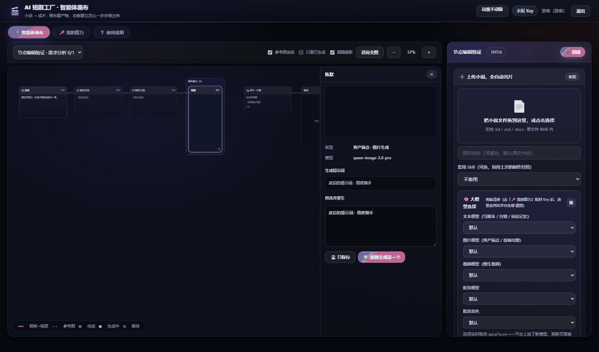

# 配图清单

> **20 张图，全部基于真实产出**，不是示意图、不是设计稿。
> 每张都标了：本地文件、在线地址、尺寸、**画面里实际有什么**、建议用途、放在哪一节。
>
> ✅ = 已在线可访问（可直接复制链接用）｜📁 = 包内 `assets/` 下有文件，需自行部署才有 URL

---

## 一、总览

| # | 文件 | 尺寸 | 在线 | 一句话内容 |
|---|---|---|---|---|
| 1 | `film/01-hero-nezha.png` | 1280×720 | ✅ | **哪吒伸手按乾坤圈**（头图级） |
| 2 | `film/02-anchors-nezha.png` | 1938×546 | ✅ | 角色三视图 + 场景四角度 + 道具 |
| 3 | `film/03-storyboard-wall-nezha.png` | 1938×822 | ✅ | **12 镜分镜墙（4×3）** |
| 4 | `film/04-film-frames-nezha.png` | 1452×822 | ✅ | 成片抽帧 9 帧 |
| 5 | `film/05-storyboard-wall-wukong.png` | 1400×1192 | ✅ | 孙悟空 **43 镜**分镜墙 |
| 6 | `film/06-hero-wukong.png` | 1280×720 | 📁 | 孙悟空剧照 |
| 7 | `film/07-anchors-wukong.png` | 1938×546 | 📁 | 孙悟空锚点物料 |
| 8 | `film/08-film-frames-wukong.png` | 1452×822 | 📁 | 孙悟空成片抽帧 |
| 9 | `film/09-hero-yuye.png` | 1280×720 | 📁 | 雨夜最后一单剧照 |
| 10 | `film/10-film-frames-yuye.png` | 1452×822 | 📁 | 雨夜成片抽帧 |
| 11 | `ui/11-single-page.png` | 1780×1050 | 📁 | 一句话生成小说的界面 |
| 12 | `ui/12-canvas-full.png` | 1680×1000 | 📁 | **完整画布：全流水线节点** |
| 13 | `ui/13-canvas-video-node.png` | 1680×1000 | 📁 | **视频节点详情：实扣点数** |
| 14 | `ui/14-project-plan-cards.png` | 1780×1050 | 📁 | 项目规划确认卡片 |
| 15 | `ui/15-prompt-edit.png` | 1780×1150 | 📁 | 提示词编辑弹窗 |
| 16 | `ui/16-node-edit.png` | 1780×1050 | 📁 | 节点编辑 / 重生成 |
| 17 | `proof/17-charsheet-real.png` | 1400×800 | 📁 | **角色设定分析图（三视图）** |
| 18 | `proof/18-model-picker.png` | 1920×1200 | 📁 | 模型选择（实时取自 api.a7w.cn） |
| 19 | `proof/19-voice-650.png` | 1780×1100 | 📁 | 650 音色选择 |
| 20 | `proof/20-node-model-roi.png` | 1780×1100 | 📁 | 节点级模型与画幅覆盖 |

**在线根地址**：`https://hq.a7w.cn/showcase/`
已部署的 5 个文件（`nezha_hero` / `nezha_anchors` / `nezha_storyboard_wall` / `nezha_film_frames` / `wukong_storyboard_wall`）可直接引用，例如：

```
https://hq.a7w.cn/showcase/nezha_hero.png
https://hq.a7w.cn/showcase/wukong_storyboard_wall.png
```

> **部署其它图的命令**（如果你有服务器访问权）：
> 把 `assets/` 里的文件传到 `https://hq.a7w.cn/showcase/` 下同名文件即可。
> 例如 `proof/17-charsheet-real.png` → `https://hq.a7w.cn/showcase/charsheet-real.png`。

---

## 二、按「说服力等级」分组

### ★★★ 头图级（放文章开头 / 朋友圈封面）


**`film/01-hero-nezha.png`（1150×646）** — **哪吒伸手按乾坤圈**

画面里实际有：深红高马尾、左眉旧疤、黑灰夹克、脖子金属圈、手腕红绫（5 处造型特征全部可见），乾坤圈金属环上有焊接痕，背景是陈塘关海边 + 半塌龙王庙，桌上有话筒、场记板、笔记本电脑（演播室设定）。

**这是最好的一张**——细节全部到位，**画面里没有任何字幕**，质感接近实拍。

| 用途 | 说明 |
|---|---|
| 文章头图 / 首屏 | 最有故事感 |
| 朋友圈封面 | 裁 2.35:1 |

**裁头图的方法**：从 1280×720 裁 2.35:1 → 裁成 1280×545，再缩到 900×383（微信头图比例）。

备用头图：`film/06-hero-wukong.png`、`film/09-hero-yuye.png`。

### ★★★ 说服力级（放「人物一致性」那一节）


**`film/02-anchors-nezha.png`（1600×450）** — 锚点物料总览

画面里实际有 5 块：**哪吒角色三视图**（正面/侧面/背面）+ **主持人三视图** + **场景四角度** + **乾坤圈**（金色圆环，带焊接痕）+ **莲花台**（铜制）。

**这张特别好用**：角色设定图里有**正面 + 侧面 + 背面**三个角度——**这就是「一个角色挂多张参考图」的可视化证明**，比文字说一百遍都强。

还有一个更精细的版本，是「锚点描述要具体到可验证」的最佳例证：


**`proof/17-charsheet-real.png`（1200×685）** — **角色设定分析图：都市外卖员**

画面里实际有：**面部特写**（标注发型/眉毛/眼神）+ **全身正面 / 侧面 / 背面**（逐项标注外套、内搭、背带、裤子、鞋子）+ **色彩规范**（主色/辅色/点缀色/暗部色，带 HEX）+ **材质说明**（冲锋衣防水尼龙、连帽衫纯棉、工装裤耐磨帆布）+ **装备参数**（反光条宽度 5cm、鞋底磨损 30%）。

这是「**具体到可验证**」的教科书级例子——每一项都能拿着成片逐格核对「有 / 没有」。

### ★★★ 震撼级（放「整体产出」那一节）


**`film/03-storyboard-wall-nezha.png`（1100×466）** — **12 个镜头首帧拼成的分镜墙（4×3）**

**证明「成片质量」和「不换脸」**。哪吒在全部 12 格里是同一张脸、同一套造型。
主持人出现在第 1 行第 3 格、第 2 行第 2 格。

> ⚠️ **看这张图时请只用哪吒那部分当一致性证据** —— 主持人的脸在不同镜头间是漂的。
> 原因与修法见下面第四节。


**`film/05-storyboard-wall-wukong.png`（1000×851）** — 孙悟空 **43 镜**分镜墙

比哪吒那部规模大三倍多。**证明这套流水线能扛住长片**。


**`film/04-film-frames-nezha.png`（1200×679）** — 从**成片**里抽的 9 帧

**证明「这是真成片，不是拼图」**。注意和分镜墙的区别：分镜墙是**首帧图**，这一张是从**渲染出来的视频**里抽帧。

### ★★ 信任状级（放「成本透明 / 可管控」那一节）


**`ui/13-canvas-video-node.png`（1400×833）** — **视频节点详情面板**

画面里实际有：类型「视频·图生视频」、模型 `wan3.0-video`、任务号 `task_vh3`、**实扣点数 100 点**、生成时间、时长 5 秒、**来源首帧缩略图**、完整生成提示词。

**这是最强的信任状**——每一条生成都能查到它花了多少点。


**`ui/12-canvas-full.png`（1400×833）** — 完整画布

画面里实际有：顶部标签「画布视图 / 智能体流水线 / 我的算力 / 脚本与出片面板 / 使用说明」；节点从左到右是**剧本节点**（绿色）→ **资产锚点节点**（紫色）→ **分镜表** → **首帧图** → **视频**；连线有流水线主线、参考图虚线、**橙色粗线（首帧图 → 视频）**。

**证明画布把整条链路都连起来了。**

### ★★ 界面操作级


**`ui/11-single-page.png`（1400×825）** — 一句话生成小说的界面

画面里实际有：顶部说明「小说 → 成片，只在计划确认时打断一次」；右侧面板「➕ 上传小说，全自动出片」带拖拽区；**「大模型选择」区块**（文本模型 / 图片模型 / 视频模型 / 配音模型 / 配音音色，全为「默认」）；说明文字「选项实时取自 api.a7w.cn——平台上加了新模型，刷新页面就能选到」。

> ⚠️ **这一张是空状态**（还没有项目）。要展示「正在生成」的动感，需要重拍——见第五节。


**`ui/14-project-plan-cards.png`（1400×825）** — 项目规划阶段的确认卡片

画面里实际有：三张卡片 —— **① 素材**（外卖员暴雨夜接到殡仪馆订单，收货人是自己）→ **② 需求分析**（素材体量、核心矛盾、核心看点：「死了三年的外卖员」）→ **③ 制作计划**（总镜头数 5 幕、单镜时长 1.5 分钟、总时长约 8 分钟、**情绪曲线**、**核心看点 5 条**、**叙事节奏与钩子**）；右下角是 **1/6 → 6/6 的编号进度**（制作计划 / 资产锚点 / 分镜 / 宫格关键帧 / 视频生成 / 后期）。

> **注意**：这一张记录的时间是 `9/17`，属于较早的一次跑批。


**`proof/18-model-picker.png`（1400×875）** — 模型选择

画面里实际有：**「大模型选择」区块红点标着「选项实时取自 api.a7w.cn」**；五组下拉 —— 文本模型（写剧本/分镜/站位记忆）、图片模型（资产锚点/首帧出图）、视频模型（图生视频）、配音模型、配音音色；底部提示「选项实时取自 api.a7w.cn——平台上加了新模型，刷新页面就能选到」。

**这一张证明了「模型不是我写死的，是从平台实时拉的」。**


**`proof/19-voice-650.png`（1400×865）** — 音色选择弹窗

画面里实际有：标题「为【默认】选择音色」、搜索框（输入「台湾」）、**右上角显示「3 / 650 个音色」**、结果列表（优质台湾腔 / 台湾男青年音放讲述 / 台湾 青音，右侧标「热门音色」「豆包方言」）、底部「已选：优质台湾腔」+ 按钮「跟随全局 / 确定」。

**证明「每个角色可以选不同声线」**，而且音色库有 650 个。


**`ui/15-prompt-edit.png`（1400×904）** — 提示词编辑弹窗

画面里实际有：节点详情（类型「资产锚点·图片生成」、模型 `qwen-image-3.0-pro`）、**生成提示词**（"外貌测试提示词：雨夜外卖员，电影感，不要字幕"）、**修改并重生**文本框、底部模型选择 `gpt-image-2-pro` / 尺寸 `16:9` / 清晰度 `2K` / 数量 `×1`、计数「24 / 7500」、按钮「保存」「重新生成一个」。

左侧画布能看到「素材（来自剧本）→ 需求分析 → 项目规划 → 资产锚点」四张卡片的依赖链。


**`proof/20-node-model-roi.png`（1400×865）** — 节点级模型与画幅覆盖

画面里实际有：节点详情里**单独把这个节点的模型指定成 `qwen-image-3.0-pro`**、尺寸下拉显示「1024*1792（竖屏）」、按钮「仅保存 / 重新生成一个」；右侧面板同步显示「平台共 103 个模型 / 650 个音色」。

> ⚠️ 这一张的节点详情里有一条 `HTTP 402` 报错残留（点数不足）。**用在成本那一节说明「余额不够会明确报出来」是可以的，但别用作正向宣传图。**



**`ui/16-node-edit.png`（1400×825）** — 节点编辑 / 重生成

和 15 类似，但状态不同：右上角显示「未配 Key」，节点详情的「生成提示词」为空、类型「资产锚点·图片生成」、模型 `qwen-image-3.0-pro`，底部按钮「仅保存 / 重新生成一个」。

> ⚠️ 这一张是**未配 Key 的状态**，更适合用来讲「首次使用要先配 Key」，不适合当正向宣传图。

---

## 三、文章 / 宣传物料里的配图位置建议

```
【开头 hook】
  → film/01-hero-nezha.png        （哪吒按乾坤圈，最有故事感）

【"坑二：第 1 集和第 20 集不是同一个人" 这一节】
  → proof/17-charsheet-real.png   （锚点物料长什么样）
  → film/02-anchors-nezha.png     （多参考图锁长相）
  → film/03-storyboard-wall-nezha.png（12 镜同一角色，证明不换脸）

【"真实数据：我们自己跑了几部" 这一节】
  → film/04-film-frames-nezha.png （成片抽帧，证明是真成片）
  → film/05-storyboard-wall-wukong.png（43 镜的规模）

【"全程成本可见" 这一节】
  → ui/13-canvas-video-node.png   （实扣点数摆在节点上）
  → proof/18-model-picker.png     （模型实时取自 api.a7w.cn）

【"能暂停、能续跑、能重试" 这一节】
  → ui/12-canvas-full.png         （全流水线一眼看全）

【"五步出片" 这一节】
  → ui/11-single-page.png         （一句话生成）
  → ui/14-project-plan-cards.png  （唯一的人工确认点）

【结尾】
  → film/01-hero-nezha.png 或 film/06-hero-wukong.png 再出现一次
```

### 如果时间有限，只放这 5 张

```
① film/01-hero-nezha.png           头图，传播力最强
② film/03-storyboard-wall-nezha.png 一致性证据
③ film/02-anchors-nezha.png        核心差异化（多参考图）
④ ui/13-canvas-video-node.png      信任状（实扣点数）
⑤ film/05-storyboard-wall-wukong.png 规模证据
```

这 5 张就够撑起整篇了。

---

## 四、⚠️ 必须指出的一致性问题（这是真实发现）

**我们在做分镜墙的时候发现：主角是稳的，配角会漂。**

看 `film/03-storyboard-wall-nezha.png`：

```
第 1 行第 3 格：主持人（盘发，黑上衣）
第 2 行第 2 格：主持人 ← 和上面比，脸型有变化
```

**哪吒是稳的**（全部 12 格都是同一张脸、同一套造型），**但主持人偏了。**

**原因**：

| 角色 | 锚点约束 | 结果 |
|---|---|---|
| 哪吒 | **5 处具体造型细节**：深红高马尾 / 左眉旧疤 / 黑灰夹克 / 脖子金属圈 / 手腕红绫 | **特征越具体越容易被模型抓住** → 稳 |
| 主持人 | **相对笼统**：黑色中式立领 / 低发髻 / 翡翠平安扣 | **约束力弱一些** → 漂 |

**这正好印证了产品逻辑**：

```
锚点描述越具体  → 一致性越好
多挂几张参考图  → 一致性越好
```

**建议**：

1. **这不影响发文章**（观众不会逐格对比主持人）
2. **但如果要拿这张图当「一致性」的证据，建议只用哪吒那部分**
3. **产品上**：主持人这类「配角」也应该**强制要求填 3 个以上具体特征**

---

## 五、需要补拍的界面截图

**下面这几张，现有的素材要么是空状态、要么是错误状态、要么是较早的跑批。** 要放进正式宣传物料的话需要重拍。

**统一要求**：

```
· 用 https://hq.a7w.cn/agent.html（不是本地文件）
· 浏览器窗口宽度 ≥ 1440px
· 先按 Ctrl + Shift + R 强制刷新
· 截图前把鼠标移开，别留悬停态
· 不要拍到账号余额、手机号等个人信息
```

### 补拍 1：一句话生成小说（最有传播力）

```
① 左侧面板找到「✍️ 一句话，AI 自动展开」
② 输入：一个外卖员在暴雨夜接到一单送往殡仪馆的订单，收货人写的是他自己的名字。
③ 章数选「5 章」，每章「1800 字」
④ 点「📖 写成小说」
⑤ 等进度条走到「第 3/5 章」时截图   ← 这时最有"正在生成"的动感
⑥ 完成后（显示「✅ 完成：xxxx 字」）再截一张
```

**用途**：文章开头，配合《雨夜殡单》那个例子。
**现有素材**：`ui/11-single-page.png` 是**空状态**，缺「正在生成」和「完成」两张。

### 补拍 2：分组视图（体现排版）

```
① 左栏点 ▦（分组视图）
② 选中「哪吒」项目
③ 等卡片全部加载完（图片显示出来）
④ 截全屏
```

**用途**：证明画布排版。

### 补拍 3：锚点多参考图管理（核心卖点）

```
① 切到 ⬡ 关系视图
② 鼠标悬停在「哪吒」锚点节点上，让工具栏出现
③ 点「参考图(N)」
④ 弹窗打开后截图   ← 要能看到"主图 / 正面 / 侧面 / 服装"的列表
```

**用途**：证明「一个角色可挂多张参考图」，配合 `film/02-anchors-nezha.png`。
**现有素材**：缺。

### 补拍 4：成本预估 tooltip（信任状）

```
① 鼠标悬停在右侧栏顶部的「预估 X 点」小条上
② 等 tooltip 弹出
③ 截图   ← 要能看到「锚点 X 点 / 首帧 X 点 / 视频 X 点 / 配音 0 点 / 合成 0 点」
```

**用途**：证明「成本全额透明」——**注意要能拍到「配音 0 点 / 合成 0 点」这两行**，这是最强的信任状。
**现有素材**：`ui/13-canvas-video-node.png` 只拍了单个节点的实扣点数，缺总账 tooltip。

### 补拍 5：任务中心（长任务可管控）

```
① 右侧栏顶部点「任务」按钮
② 面板打开后截图   ← 要能看到进度条 + 阶段列表 + 5 个操作按钮
```

**用途**：证明「能暂停/续跑/重试/对账」。
**现有素材**：缺。

### 补拍 6：多版本择优

```
① 找一个出过 2 版以上的视频节点
② 悬停让工具栏出现
③ 截图   ← 要能看到 `◀ 2/3 ▶` 那个切换器
```

**用途**：证明「一个镜头多版本可选」。
**现有素材**：缺。

### 补拍 7：分镜表

```
① 分组视图里找到「分镜设计」卡片
② 截图   ← 要能看到 镜号 / 景别 / 机位 / 时长 / 台词 五列
```

**用途**：证明分镜表的字段完整度。
**现有素材**：缺。

### 补拍优先级

**如果时间有限，只补这 3 张**（覆盖最核心的三个卖点）：

```
① 补拍 1  一句话生成小说     → 传播力最强
② 补拍 3  多参考图管理       → 核心差异化
③ 补拍 4  成本预估 tooltip   → 信任状（要拍到"配音 0 点"）
```

---

## 六、尺寸规范

| 位置 | 建议尺寸 | 说明 |
|---|---|---|
| 头图 / 朋友圈封面 | **900×383**（2.35:1） | 用 `film/01-hero-nezha.png` 裁 |
| 正文插图 | 宽 900px | 现有 1280 / 1780 / 1938 宽都够，等比缩到 900 |
| 分镜墙 | 宽 900px | 原 1938×822 → 缩到 900×382 |
| 43 镜分镜墙 | 宽 900px | 原 **1400×1192** → 缩到 900×766（很高，建议单独成段） |
| 九宫格 | 宽 900px | 原 1452×822，缩到 900 |
| 界面截图 | 宽 900px | 原 1680~1920 宽，缩到 900 后小字仍可辨 |

**在线已部署的 5 张**（可直接用，无需自己部署）：

```
https://hq.a7w.cn/showcase/nezha_hero.png
https://hq.a7w.cn/showcase/nezha_anchors.png
https://hq.a7w.cn/showcase/nezha_storyboard_wall.png
https://hq.a7w.cn/showcase/nezha_film_frames.png
https://hq.a7w.cn/showcase/wukong_storyboard_wall.png
```

> **注意**：在线版本与包内本地文件是**同名不同压缩**的两份（尺寸一致，体积有差异）。
> 要引用在线的，就用上面的 URL；要用包内的，就自己部署。

---

## 七、自检

- [ ] 引用「一致性」证据时**只用哪吒那部分**（主持人会漂）
- [ ] `ui/16-node-edit.png`（未配 Key 状态）**没有**被当正向宣传图
- [ ] `proof/20-node-model-roi.png` 里的 **402 报错残留**已确认不影响要讲的观点
- [ ] 截图里**没有账号余额、手机号等个人信息**
- [ ] 头图已裁成 2.35:1（900×383）
- [ ] 引用在线图时用的是 `hq.a7w.cn/showcase/` 下的 URL
- [ ] 正文插图宽 900px（原图等比缩）
